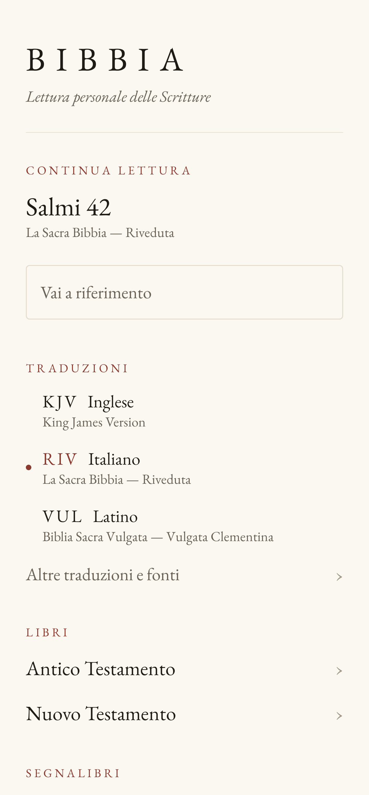
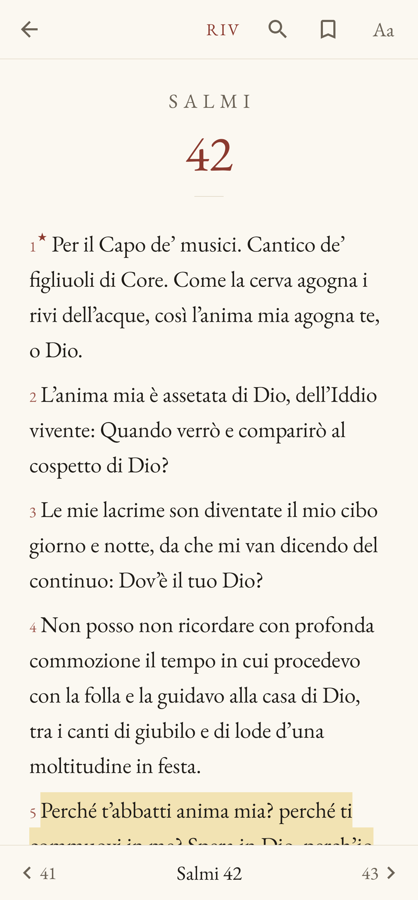
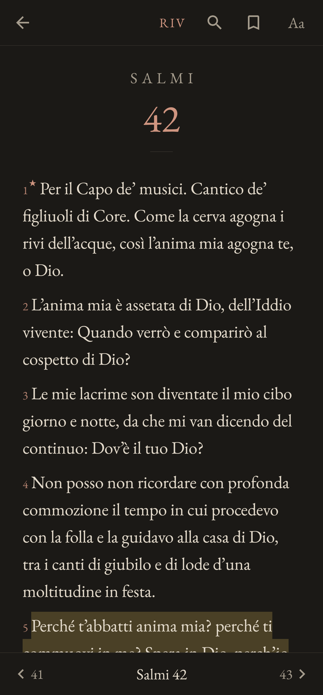
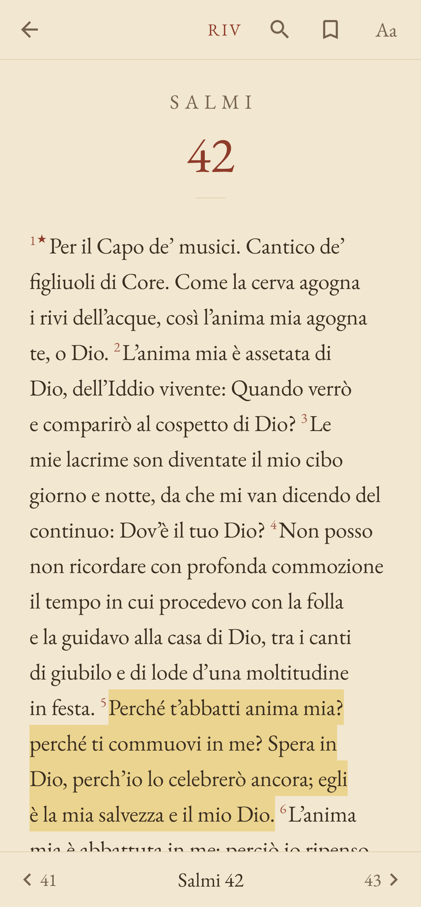

# Bibbia — lettura personale delle Scritture (Android)

App Android nativa, sobria ed elegante, per la lettura personale e meditativa della Bibbia.
Funziona interamente offline, non richiede account e non raccoglie alcun dato.

| Home | Lettura (Carta) | Lettura (Notte) | Modalità Pagina (Seppia) |
|---|---|---|---|
|  |  |  |  |

## Traduzioni

| Sigla | Traduzione | Lingua | Disponibilità |
|---|---|---|---|
| KJV | King James Version (1769) | Inglese | inclusa, offline |
| RIV | La Sacra Bibbia — Riveduta (Luzzi, 1927) | Italiano | inclusa, offline |
| VUL | Vulgata Clementina (1592/1598) | Latino | inclusa, offline |
| DIO | La Sacra Bibbia — Diodati (1885) | Italiano | scaricabile su richiesta, poi offline |

Tutte di pubblico dominio. La **CEI 2008 non è inclusa** perché il testo è protetto e non
redistribuibile senza autorizzazione: dettagli, fonti e condizioni in
[LICENSES/ATTRIBUTIONS.md](LICENSES/ATTRIBUTIONS.md).

## Funzioni

- **Lettura** con tipografia da libro: EB Garamond o Literata, numeri dei versetti in rosso
  rubrica discreto, margini ampi, larghezza di riga limitata anche su tablet e in orizzontale.
- Due impaginazioni: **Versetti** (un capoverso per versetto) e **Pagina** (prosa continua con
  rientri, paragrafi della KJV, impaginazione automatica per le altre traduzioni).
- Temi **Carta**, **Seppia**, **Notte** (carbone caldo, non nero puro) o automatico di sistema.
- Dimensione del carattere, interlinea, giustificazione con sillabazione, numeri dei versetti,
  schermo sempre acceso: tutto salvato automaticamente.
- **Navigazione rapida**: Libro → Capitolo, ‹ 41 · 42 · 43 › nella barra inferiore, scorrimento
  orizzontale per voltare capitolo, attraversando i confini dei libri.
- **Vai a riferimento**: "Gv 3,16", "Giovanni 3:16", "Salmi 137", "Isaia 40", "1 Cor 13,4-7",
  "John 3:16", "Psalmi 41", "III Regum 19"… (italiano CEI, inglese, latino).
- **Continua lettura**: l'ultima posizione (fino al versetto) viene ricordata da sola.
- **Segnalibri** su un versetto (un tocco) o su un intero capitolo, con nome/nota, anteprima,
  traduzione e data; eliminazione con "Annulla".
- **Evidenziazioni** in quattro colori tenui (ocra, salvia, cielo, rosa).
- **Ricerca full-text** locale (SQLite FTS4): indifferente ad accenti e maiuscole
  ("citta" trova "città", "caelum" trova "cælum"), prefissi ("love" trova "loved"), frasi
  esatte tra virgolette, filtro per traduzione e per testamento.
- **Confronto** dello stesso versetto in tutte le traduzioni installate, con conversione della
  numerazione dei Salmi per la Vulgata.
- **Copia** di un versetto con riferimento.

## Privacy

Nessun account, login, pubblicità, analytics o tracciamento. Segnalibri, note, evidenziazioni,
preferenze e posizione di lettura restano nel database locale del dispositivo
(`allowBackup="false"`: esclusi anche dal backup su cloud). La rete viene usata **solo** quando
l'utente sceglie di scaricare una traduzione aggiuntiva.

## Compilare e installare

Requisiti: Android Studio (Ladybug o successivo) oppure JDK 17+ con Android SDK 35.

1. Aprire la cartella `bibbia-android/` in Android Studio (*File → Open*).
2. Attendere la sincronizzazione di Gradle, poi *Run ▶* su un telefono con Android 8.0+ (API 26).

Da riga di comando:

```bash
cd bibbia-android
./gradlew assembleDebug          # app/build/outputs/apk/debug/app-debug.apk
./gradlew assembleRelease        # APK ottimizzato (R8), firmato con la chiave di debug
./gradlew testDebugUnitTest      # test
adb install app/build/outputs/apk/release/app-release.apk
```

L'APK release è firmato con la chiave di debug per poterlo installare subito sul proprio
telefono; per una pubblicazione su store va configurata una propria chiave in
`app/build.gradle.kts`.

Al **primo avvio** i tre testi inclusi vengono importati nel database locale (qualche secondo,
con indicatore di avanzamento). Da quel momento tutto funziona senza Internet.

## Architettura

```
app/src/main/java/it/lectio/bibbia/
├── domain/                 logica pura, senza Android
│   ├── model/              Translation, Book, Chapter, Verse, VerseRef, Bookmark, Canon…
│   ├── ReferenceParser     "Gv 3,16" → (JHN, 3, 16)
│   ├── ChapterNavigator    capitolo precedente/successivo fra i libri
│   └── VersificationMapper numerazione ebraica ↔ Vulgata (Salmi)
├── data/
│   ├── database/           Room: traduzioni, libri, versetti + indice FTS4, segnalibri, evidenziazioni
│   ├── source/             TranslationSource (assets, download), parser VPL, catalogo traduzioni
│   └── repository/         Translation-, Bible-, Bookmark-, Search-, SettingsRepository
├── ui/                     Jetpack Compose + ViewModel
│   ├── home/  reader/  books/  bookmarks/  search/  settings/  translations/  about/
│   ├── components/  theme/ (palette carta/seppia/notte, tipografia)
├── navigation/             Navigation Compose con rotte type-safe
├── util/                   normalizzazione del testo, anteprime
├── AppContainer            dipendenze (DI manuale, nessun framework)
└── MainActivity            unica Activity
```

**Modello dati.** I libri sono identificati dal codice USFM (`GEN`, `PSA`, `JHN`…), stabile e
indipendente dalla traduzione; un versetto è `(translationId, bookId, chapter, verse)`. Ogni
traduzione dichiara lingua, ordine canonico (protestante, Vulgata, cattolico) e sistema di
numerazione: aggiungere una traduzione significa aggiungere una voce in `TranslationCatalog`.
Segnalibri ed evidenziazioni usano gli stessi identificatori e sopravvivono alla rimozione di
una traduzione.

**Offline-first.** Ogni testo passa da una `TranslationSource` (asset incluso o download una
tantum) a un'importazione **atomica** in Room (una transazione: o completa o assente; se l'app
viene chiusa a metà, riprende al riavvio). Lettura, ricerca, segnalibri e posizione leggono solo
dal database locale. Gli errori di download (assenza di rete, timeout, server, dati non validi,
spazio) diventano uno stato `FAILED` con messaggio e pulsante "Riprova", senza toccare le altre
traduzioni.

**Stato e configurazione.** I ViewModel espongono `StateFlow`; posizione di lettura, ricerca e
selezioni sopravvivono a rotazione e morte del processo (`SavedStateHandle`, `rememberSaveable`).

## Test

`./gradlew testDebugUnitTest` (JVM + Robolectric, nessun dispositivo necessario):

| Area | Test |
|---|---|
| Parser dei riferimenti | `ReferenceParserTest` |
| Navigazione fra capitoli | `ChapterNavigatorTest`, `ReaderViewModelTest` |
| Numerazione Salmi | `VersificationMapperTest` |
| Testi inclusi completi e integri | `BundledTextsTest`, `RealAssetInstallTest` |
| Repository / installazione, database vuoto, errore di download, dati corrotti | `TranslationRepositoryTest` |
| Ricerca | `SearchRepositoryTest`, `TextProcessingTest` |
| Database segnalibri ed evidenziazioni | `BookmarkRepositoryTest` |
| Persistenza preferenze e posizione | `SettingsRepositoryTest` |
| Rotazione / ripristino stato, tema scuro | `ReaderViewModelTest`, `BookChapterChooserTest` |

Gli screenshot di `docs/screenshots` si rigenerano con
`SHOTS=/una/cartella ./gradlew :app:testDebugUnitTest --tests '*ScreenshotCapture*'`.
